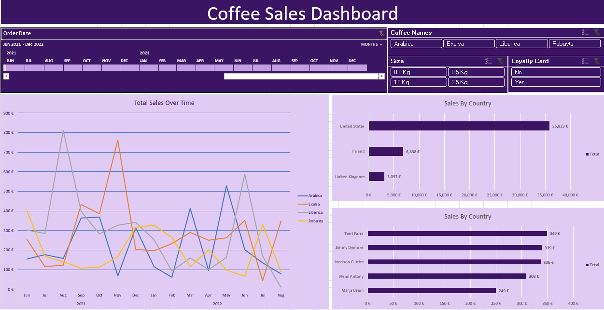

📊 Coffee Sales Dashboard (Excel)
📌 Project Overview

This project is an interactive Coffee Sales Dashboard built using Microsoft Excel.
It provides insights into coffee sales performance across different countries, coffee types, package sizes, and customer loyalty status.

The dashboard helps stakeholders quickly analyze trends, compare sales, and make data-driven decisions.

🎯 Objectives

- Analyze total sales over time

- Compare sales by country

- Track performance of different coffee types

- Understand customer behavior using loyalty card data

- Provide interactive filtering for better analysis

🛠 Tools & Technologies Used

- Microsoft Excel

- Pivot Tables

- Pivot Charts

- Slicers & Timelines

- Excel Formulas

- Data Visualization Techniques

📈 Dashboard Features

- Time-based sales analysis (monthly & yearly)

- Sales by country comparison

- Coffee type analysis (Arabica, Excelsa, Liberica, Robusta)

- Package size filtering (0.2kg, 0.5kg, 1kg, 2.5kg)

- Loyalty card based insights

- Interactive slicers for dynamic filtering
